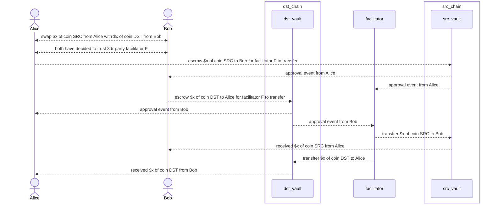

```mermaid
sequenceDiagram

actor Alice
actor Bob
box dst_chain
participant dst_vault
end
participant facilitator

box src_chain
participant src_vault
end
Alice <<-->> Bob: swap $x of coin SRC from Alice with $x of coin DST from Bob 
Alice <<-->> Bob: both have decided to trust 3dr party facilitator F
Alice -->> src_vault: escrow $x of coin SRC to Bob for facilitator F to transfer
src_vault -->> Bob: approval event from Alice
src_vault -->> facilitator: approval event from Alice
Bob -->> dst_vault: escrow $x of coin DST to Alice for facilitator F to transfer
dst_vault -->> Alice: approval event from Bob
dst_vault -->> facilitator: approval event from Bob
facilitator -->> src_vault: transfter $x of coin SRC to Bob
src_vault -->> Bob: received $x of coin SRC from Alice 
facilitator -->> dst_vault: transfter $x of coin DST to Alice
dst_vault -->> Alice: received $x of coin DST from Bob

```
