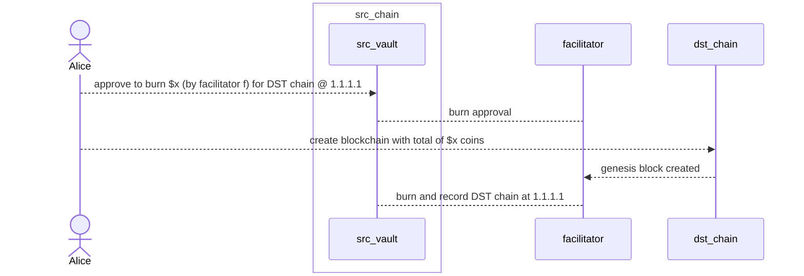
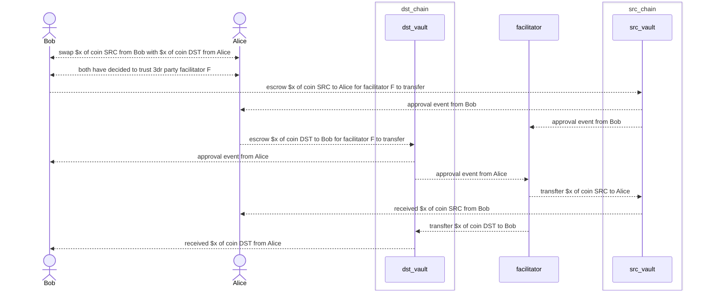

## Alice creates DST blockchain

```mermaid
sequenceDiagram

actor Alice
box src_chain
participant src_vault
end
participant facilitator
participant dst_chain

Alice -->> src_vault: approve to burn $x (by facilitator f) for DST chain @ 1.1.1.1
src_vault --> facilitator: burn approval
Alice -->> dst_chain: create blockchain with total of $x coins
dst_chain -->> facilitator: genesis block created
facilitator --> src_vault: burn and record DST chain at 1.1.1.1 
```

## Bob gets DST coin from Alice 

```mermaid
sequenceDiagram

actor Bob
actor Alice
box dst_chain
participant dst_vault
end
participant facilitator

box src_chain
participant src_vault
end
Bob <<-->> Alice: swap $x of coin SRC from Bob with $x of coin DST from Alice 
Bob <<-->> Alice: both have decided to trust 3dr party facilitator F
Bob -->> src_vault: escrow $x of coin SRC to Alice for facilitator F to transfer
src_vault -->> Alice: approval event from Bob
src_vault -->> facilitator: approval event from Bob
Alice -->> dst_vault: escrow $x of coin DST to Bob for facilitator F to transfer
dst_vault -->> Bob: approval event from Alice
dst_vault -->> facilitator: approval event from Alice
facilitator -->> src_vault: transfter $x of coin SRC to Alice
src_vault -->> Alice: received $x of coin SRC from Bob 
facilitator -->> dst_vault: transfter $x of coin DST to Bob
dst_vault -->> Bob: received $x of coin DST from Alice

```
