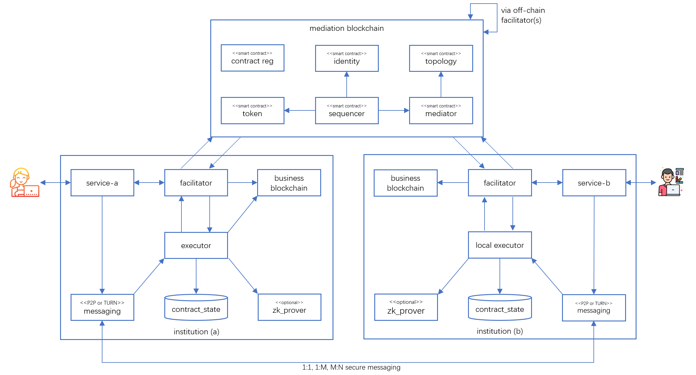

# Tokenized Finance Architecture 

## Summary

Blockchain and tokenization has the potential to profoundly transform the financial industry. Arguably the Ethereum ecosystem has strong presence in this field, but it intrinsicallly suffers from security, privacy and compliance concerns on implementing utility tokens, NFT and RWA.   

Canton by design has security, privacy and compliance in mind, but it isolates itself away from the massive token ecosystem on Ethereum. Its tokenization implementation via Splice looks like a "bolted-on" afterthought.

This document records JZ's architecure proposals on tokenized finance, with the following goals and objectives:
1. Fully compatible with the Ethereum ecosystem, including Solidity smart contracts, ERC standards, zero-knowledge proofs etc. Better if it runs on public Ethereum.
2. Privacy and compliance strength on par or better than the Canton network for cross-institution collaboration. Better if compatible with Canton protocol and DAML.

## Preface

PDX has been supporting totally private smart contracts without weakening consensus strength on its Utopia blockchain platform since 2017. It does this via a patent-awarded technology internally called "selective-existence of data and code" on blockchain nodes, meaning only the nodes trusted by the stakeholders of business collaboration posess the sensitive data (state) and code (logic) of that collaboration. What canton can achieve is already achieved on PDX Utopia blockchain - some caveat or loose end may exist though.

PDX Utopia blockchain is fully compliant with Ethereum EVM and its web3 API. Besides its support on totally private smart contracts, PDX Utopia has quite some unique capabilities, such as:

1. *Asynchronous consensus* A scalable, performant, asynchronous consensus algorithm achieving fair consensus (each node with one vote) with O(n) complexity, also known as PDX consensus
  
2. *Asynchronous ledgering* Each smart contract cluster has its own distinguished world state that does not interfere with other smart contract clusters, hence can independenly execute without interfering each other.
  
3. *Parallel TX processing* Transactions destined for unrelated smart contracts are processed in parallel; related smart contracts auto-organized into a "smart contract cluster".

## Option 1: On Ethereum 


    
     

  
```
