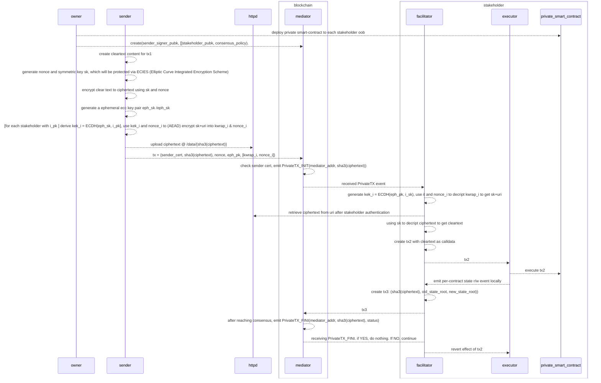

```mermaid
sequenceDiagram
participant owner
participant sender
participant httpd
box blockchain
participant mediator
end
box stakeholder
participant facilitator
participant executor
participant private_smart_contract
end

owner -->> private_smart_contract: deploy private smart-contract to each stakeholder oob

owner -->> mediator: create(sender_signer_pubk, []stakeholder_pubk, consensus_policy). 

sender -->> sender: create cleartext content for tx1
sender -->> sender: generate nonce and symmetric key sk, which will be protected via ECIES (Elliptic Curve Integrated Encryption Scheme)
sender -->> sender: encrypt clear text to ciphertext using sk and nonce
sender -->> sender: generate a ephemeral ecc key pair eph_sk /eph_sk
sender -->> sender: [for each stakeholder with i_pk ] derive kek_i = ECDH(eph_sk, i_pk], use kek_i and nonce_i to (AEAD)  encrypt sk+uri into kwrap_i & nonce_i
sender -->> httpd: upload ciphertext @ /data/{sha3(ciphertext)}
sender -->> mediator: tx = {sender_cert, sha3(ciphertext), nonce, eph_pk, [kwrap_i, nonce_i]} 

mediator -->> mediator: check sender cert, emit PrivateTX_INIT(mediator_addr, sha3(ciphertext))
mediator -->> facilitator: received PrivateTX event
facilitator -->> facilitator: generate kek_i = ECDH(eph_pk, i_sk), use it and nonce_i to decript kwrap_i to get sk+uri
facilitator -->> httpd: retrieve ciphertext from uri after stakeholder authentication
facilitator -->> facilitator: using sk to decript ciphertext to get cleartext
facilitator -->> facilitator: create tx2 with cleartext as calldata
facilitator -->> executor: tx2
executor -->> private_smart_contract: execute tx2
executor -->> facilitator: emit per-contract state r/w event locally
facilitator -->> facilitator: create tx3: (sha3(ciphertext), old_state_root, new_state_root))
facilitator -->> mediator: tx3
mediator -->> mediator: after reaching consensus, emit PrivateTX_FINI(mediator_addr, sha3(ciphertext), status)
mediator --> facilitator: receiving PrivateTX_FINI. if YES, do nothing. If NO, continue
facilitator -->> executor: revert effect of tx2
```
