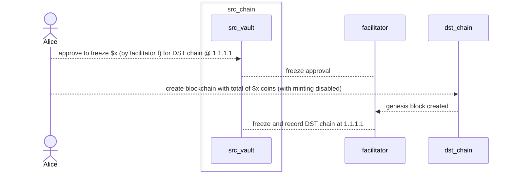
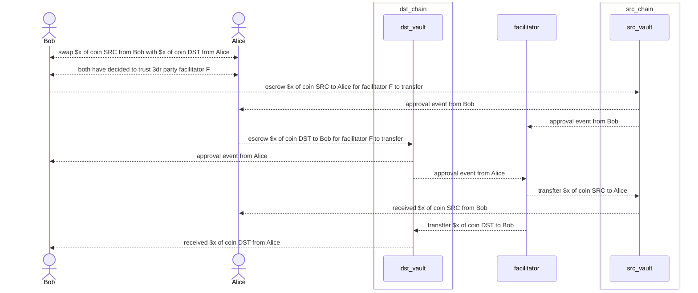

## A & B gets SRC coin as usual
From existing SRC coin holders directly or via exchange.

## Alice creates DST blockchain

## Bob gets DST coin from Alice 

## Burn on DST and de-freeze on SRC
Since DST chain has minting disabled, simply burn Charlie has on DST, and de-freeze the same amount from what Alice has been freezed.
If DST chain has minting enabled, just simply disallow this scenario to avoid DST illegally generating SRC coins.
