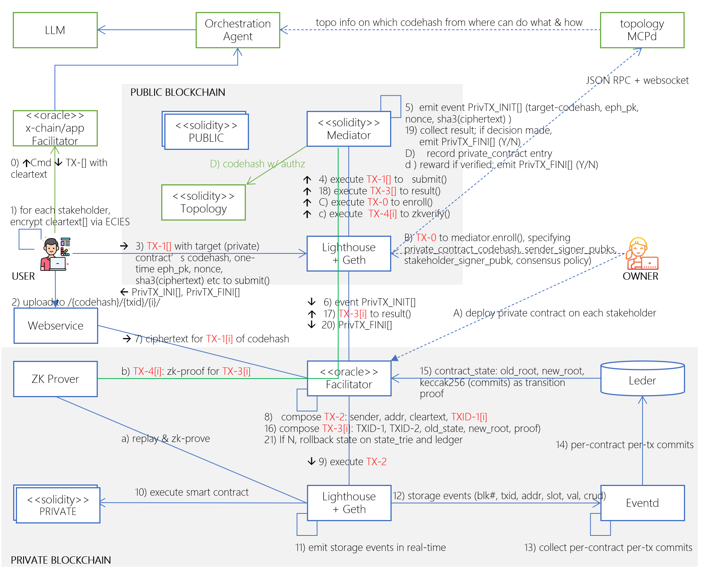

Based on JZ's patent on private smart contract and ledger on public/consortium blockchain, this is a elegant architecture to implenment Canton like cross institution collaboration, but better:
1. no reventing the wheels, sequencer is best done on chain, since it's trusted,verifiable and straightforward 
2. more secure, no transactional (not even the encrypted) data on mediation chain (equivalent to Canton's sub-domain or global domain)
4. LLM-powered intelligence to orchestrate and discompose transaction into sub-transactions for each stakeholder smart contract anywhere
5. private contracts can be on any private chain or on no chain at all.
7. per-contract state proof for easy verification w/ zero knowledge (or not)
8. Easily support multiple mediation blockchains, just, 1) sender submits different sub-transations to its specific mediator chain; 2) private facilitator implements deternimistic sequencing from multiple mediator chains.

